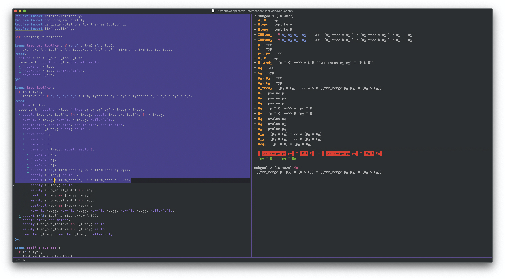
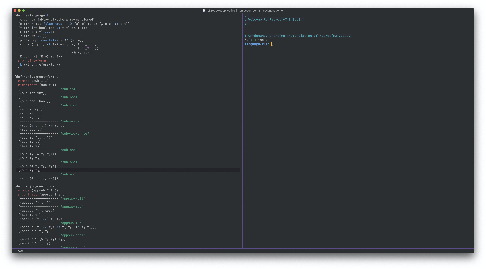

# Spacemacs Configs for PL

## Who can benefit from this code?

* Emacs users who try learn to make Spacemacs pretty neat without losing core functionalities.
* Vimmers who write a lot of Coq code per day and want to get rid of CoqIDE.
* Lispers who want better Racket or Redex coding experience.

## Screenshots

## Dependencies:

- Haskell : ghcup -> cabal, stack, ghc (https://develop.spacemacs.org/layers/+lang/haskell/README.html#dependencies)
- Coq : brew -> coqtop
- Racket/Redex : brew -> racket, raco -> drracket, raco -> redex
- Ott : opam -> ott
